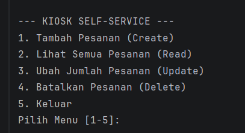
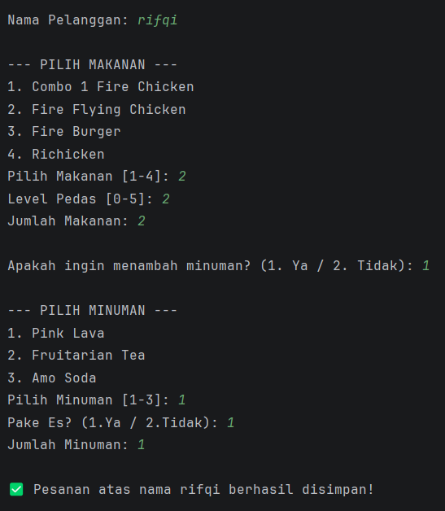
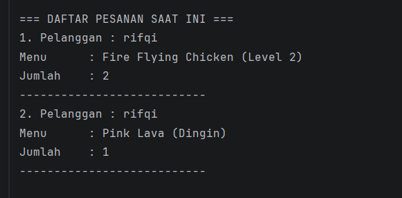
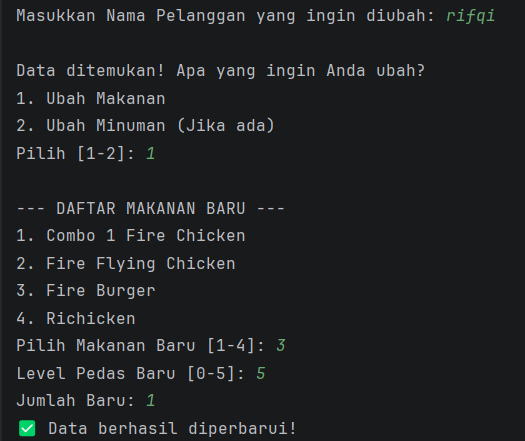
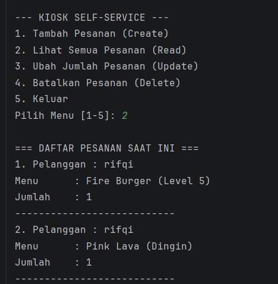
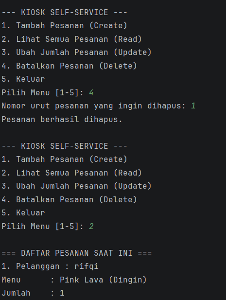

# Laporan Posttest 1 - Sistem Kiosk Self-Service Richeese Factory

* **Nama:** RIFQI AL BUKHARI
* **NIM:** 2409106112
* **Kelas:** C2

---

## 1. Deskripsi Program
Program ini adalah simulasi mesin Kiosk di restoran Richeese Factory. Sistem ini memungkinkan pelanggan untuk melakukan pemesanan makanan dan minuman secara mandiri. Data pesanan dikelola menggunakan konsep **CRUD** (Create, Read, Update, Delete) yang disimpan di dalam `ArrayList`.

### Fitur Utama:
* **Tambah Pesanan (Create):** Menginput nama pelanggan, memilih makanan (beserta level pedas), dan memilih minuman (opsional) dalam satu alur transaksi.
* **Lihat Pesanan (Read):** Menampilkan daftar pesanan yang sudah **dikelompokkan (grouped)** berdasarkan nama pelanggan agar lebih rapi.
* **Ubah Pesanan (Update):** Fitur cerdas untuk memilih spesifik item (makanan saja atau minuman saja) yang ingin diubah datanya tanpa menghapus pesanan lain.
* **Batalkan Pesanan (Delete):** Menghapus seluruh pesanan berdasarkan nama pelanggan.

---

## 2. Struktur Class (Nilai Tambah)
Program ini menggunakan **3 Class** berbeda untuk mengelola data secara terorganisir:

1.  **`Main.java`**: Class utama yang menangani logika antarmuka pengguna, menu program, dan pemrosesan data di ArrayList.
2.  **`pesanan.java`**: Class model (objek) yang menerapkan prinsip **Encapsulation** dengan atribut `private`, serta menyediakan *Constructor*, *Getter*, dan *Setter*.
3.  **`menuMakanan.java`**: Class pendukung yang digunakan dalam struktur proyek untuk manajemen data kategori menu.

---

## 3. Dokumentasi Penggunaan (Screenshot)

### Tampilan Menu Utama

* Menu Utama Yang Ada Pada Program

### Fitur Tambah Pesanan

*   Menu Fitur Tambahan Yang Ada Pada Program

### Fitur Lihat Pesanan

* Fitur Lihat Pesanan Untuk Melihat Pesanan Yang Sudah Di Pesan

### Fitur Edit Pesanan

* Fitur Edit Pesanan Untuk Mengubah Menu Yang Telah Di Pesan

* Output Lihat Pesanan Ketika Pesanan Sudah Di Ubah

### Fitur Hapus Pesanan

* Fitur Hapus Pesanan Untuk Menghapus Pesanan Yang Sudah Dilakukan
---

