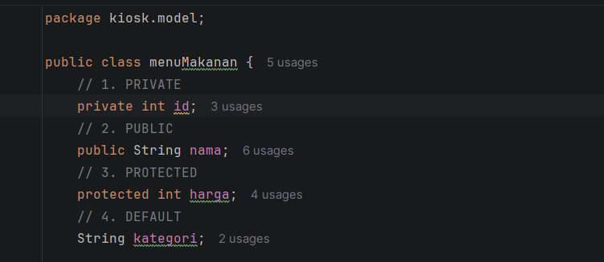
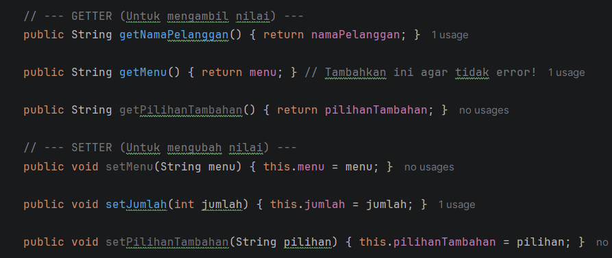

# Laporan Posttest 2 - Sistem Kiosk Self-Service 

* **Nama:** RIFQI AL BUKHARI
* **NIM:** 2409106112
* **Kelas:** C2

---

## 1. Deskripsi Program
Program ini adalah simulasi mesin Kiosk di restoran Richeese Factory. Sistem ini memungkinkan pelanggan untuk melakukan pemesanan makanan dan minuman secara mandiri. Data pesanan dikelola menggunakan konsep **CRUD** (Create, Read, Update, Delete) yang disimpan di dalam `ArrayList`.

### Fitur Utama:
* **Tambah Pesanan (Create):** Menginput nama pelanggan, memilih makanan (beserta level pedas), dan memilih minuman (opsional) dalam satu alur transaksi.
* **Lihat Pesanan (Read):** Menampilkan daftar pesanan yang sudah **dikelompokkan (grouped)** berdasarkan nama pelanggan agar lebih rapi.
* **Ubah Pesanan (Update):** Fitur cerdas untuk memilih spesifik item (makanan saja atau minuman saja) yang ingin diubah datanya tanpa menghapus pesanan lain.
* **Batalkan Pesanan (Delete):** Menghapus seluruh pesanan berdasarkan nama pelanggan.

---

## 2. Dokumentasi
### Penerapan Encapsulation dengan 4 jenis acces modiffier

### penerapan setter dan getter

